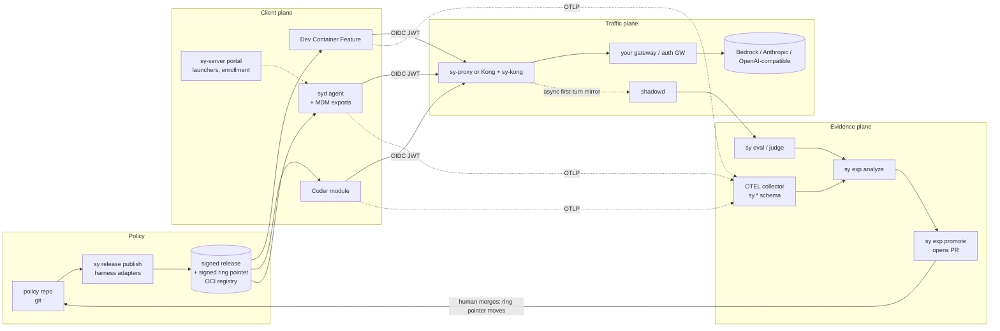
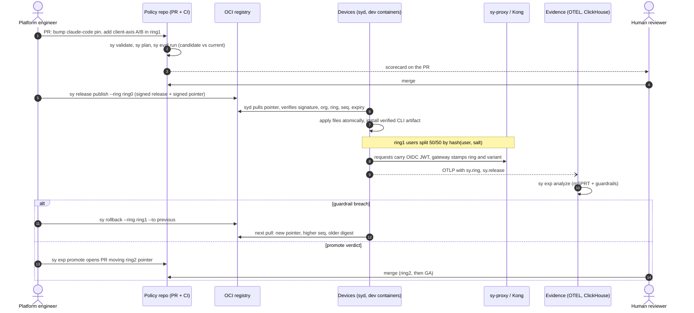

<p align="center">
  
</p>

<h1 align="center">Switchyard</h1>

<p align="center"><b>Ship AI coding tools like you ship software: versioned, signed, ring-deployed, and proven by evals.</b></p>

<p align="center">
  <a href="https://github.com/switchyard-dev/switchyard/actions/workflows/ci.yml"></a>
  <a href="https://goreportcard.com/report/github.com/switchyard-dev/switchyard"></a>
  <a href="LICENSE"></a>
  <a href="https://switchyard-dev.github.io/switchyard/"></a>
</p>

Switchyard is an open-source control plane that rolls Claude Code, Codex, Gemini CLI and Copilot CLI configuration, versions and model routes out to a company like a software release: signed, ring by ring, gated on evals, with instant rollback.

> **Status: pre-release (`v1alpha1`).** The compiler, signing and ring pointers, `syd`, `sy-proxy`, `sy-kong`, `shadowd`, `sy-server`, the Helm chart and the MCP server are implemented and unit-tested. Several integrations have never run against the real third-party system; they are listed under [What is not verified](#what-is-not-verified). No tagged release exists yet: build from source.

## The problem

It is Tuesday, 9:40am. Claude Code ships a patch release that changes how it reads a managed setting. Your auto-update, or a helpful Slack message, gets it onto 300 laptops by 10:15. Bash tool calls start failing behind your gateway. Nobody on your platform team can say which developers are on which version, whether the new version is worse, or how to undo it. The rollback plan is a Slack message asking 300 people to downgrade a CLI and edit a JSON file.

Nothing about this is exotic. It is what "deploy" looks like when AI dev tools are treated as personal software instead of production dependencies:

- **Settings sprawl.** Claude Code, Codex, Gemini CLI and Copilot CLI each have their own config format, precedence rules and enforcement knobs. Nobody owns the union.
- **No staged rollout.** Every CLI upgrade and every model alias change goes to everyone at once.
- **No gate.** "The new model feels fine" is the release criterion.
- **No rollback.** Reverting is a human process.

## Why now

- **AI CLIs ship weekly and model upgrades land monthly.** The rate of change already exceeds what an org can review by hand.
- **The vendor's central push channel is not there for you.** Claude Code's server-managed settings are not fetched when you use Bedrock or a custom `ANTHROPIC_BASE_URL`, which is exactly what orgs with a gateway do. Config has to arrive as files, MDM payloads or environment definitions, and somebody has to own that pipeline.
- **The agent is now a privileged process.** A hook is a shell command; an MCP server is a network client with your credentials. Config for these tools is a supply-chain surface, not a preference file.

## The insight

Treat AI dev-tool configuration as a **signed, ring-deployed release** with **eval-gated promotion**, and put the model traffic behind a plane you control. Then:

- a CLI or config change is a release: immutable, content-addressed, signed, and rolled through rings by re-pointing a signed pointer;
- a model change is a route at the gateway, so the rollback for the most common change is instant and touches no client;
- promotion is evidence: replay evals, sticky A/B and canary experiments, single-turn shadow comparisons. The tooling opens a PR; a human merges.

## What it is

You keep profiles, rings and experiments as YAML in git. Switchyard compiles them per harness, signs an immutable release, and publishes a signed pointer per ring. `syd` (or the Dev Container Feature, or an MDM export) verifies and applies it on each machine. `sy-proxy` (or the `sy-kong` Kong plugin) verifies the caller's OIDC token, assigns the cohort, rewrites the model alias and stamps the request. Telemetry and evals feed an analysis that yields a verdict; `sy exp promote` turns a promote verdict into a PR.



| Plane | Job | Components |
|---|---|---|
| **Client** | Make the developer environment match a signed release | `syd`, Dev Container Feature, Coder module, Codespaces, Jamf/Kandji/Intune exports, `sy-server` self-service portal |
| **Traffic** | Verify identity, assign cohorts, route and rewrite models, mirror | `sy-proxy` (stack-agnostic) or Kong + `sy-kong`, `shadowd` |
| **Evidence** | Prove a change is safe | OTEL collector, ClickHouse, `sy eval`, `sy exp analyze`, `sy exp promote` |

### Rollout: a CLI upgrade from PR to GA



## 90-second demo

Needs Go 1.25+, Docker with Compose v2, and `curl`. Nothing here talks to a real model provider: the upstreams are mocks.

```bash
git clone https://github.com/switchyard-dev/switchyard && cd switchyard
make build && export PATH="$PWD/bin:$PATH"

sy validate --policy-dir examples/acme-corp                                            # schema + guardrails
sy whoami --policy-dir examples/acme-corp --user alice@acme.com --groups ai-platform   # ring0-harness-team
sy render --policy-dir examples/acme-corp --ring ring1-canary --os linux --out /tmp/rendered   # the files syd would write

cd deploy/compose && docker compose up -d --build                         # Kong + sy-kong, mock IdP, mock upstreams, shadowd
TOK=$(curl -s 'localhost:8081/token?user=alice@acme.com&groups=ai-platform')
curl -s localhost:8080/v1/messages \
  -H "Authorization: Bearer $TOK" -H 'content-type: application/json' \
  -H 'anthropic-version: 2023-06-01' -H 'x-claude-code-session-id: s1' \
  -H 'x-sy-ring: ring3-ga' \
  -d '{"model":"sonnet","max_tokens":5,"messages":[{"role":"user","content":"hi"}]}'
# ... served-by=orch model=us.anthropic.claude-sonnet-4-5-v1:0 ... x-sy-ring:ring0-harness-team ...
docker compose down -v
```

The `x-sy-ring: ring3-ga` the client sent was discarded; the upstream saw the ring derived from the verified token, and the alias `sonnet` was rewritten to the upstream model id. The full walkthrough, including publishing, promoting and rolling back a signed release against a local registry, is the [quickstart](https://switchyard-dev.github.io/switchyard/getting-started/quickstart/).

## Who it is for

- **Platform and developer-productivity teams** running Claude Code, Codex, Gemini CLI or Copilot CLI for hundreds to thousands of engineers, especially behind Bedrock, a custom gateway, Kong, LiteLLM or Envoy.
- **Security teams** who need model allowlists, MCP allowlists, "no bypass permissions", verified config delivery and an audit trail in git.
- **Not for** a five-person team on one CLI with vendor-managed settings. Use the vendor's admin console.

## How it compares

| | Cross-harness config | Version pinning | Rings | A/B + shadow | Eval gate | GitOps + rollback | Self-hosted |
|---|---|---|---|---|---|---|---|
| Vendor admin consoles | No: one tool each | Varies | No | No | No | No | No |
| LLM gateways (LiteLLM, Portkey, Kong AI) | No: traffic only | No | Weighted routing | Routing only [a] | No | Config as code | Yes |
| Analytics (Faros, Jellyfish) | No: observe only | No | No | No | No | No | No |
| Roll your own | You build it | You build it | You build it | You build it | You build it | You build it | Yes |
| **Switchyard** | Yes | Yes (CLI-enforced or `syd`) | Yes | Yes | Yes | Yes | Yes |

[a] Kong OSS has no request-mirroring plugin and `ai-proxy-advanced` load balancing is Enterprise-only, which is why Switchyard ships `shadowd`. Switchyard complements a gateway; it does not replace one. Competitor cells summarize typical product scope and should be re-checked against each vendor before you rely on them.

## Harness capability matrix

Generated from the adapters (`sy harnesses`) and the sources cited in [`internal/harness/FACTS.md`](internal/harness/FACTS.md). "Rendered" means the adapter writes the harness's native enforcement; where it cannot, the adapter emits a warning in the release manifest instead of dropping the setting silently.

| Capability | Claude Code | Codex | Gemini CLI | Copilot CLI |
|---|---|---|---|---|
| Version pin | CLI-enforced | `syd` enforces | `syd` enforces | `syd` enforces |
| Model lock | Rendered | Rendered | Rendered | Default only (warns) |
| MCP allowlist | Rendered | Rendered | Rendered | Rendered |
| Hooks lock | Rendered | No | No | No |
| Permissions | Rendered | Rendered | Partial: `admin.secureModeEnabled` only | Rendered (`disableBypassPermissionsMode`) |
| Gateway | Rendered | Rendered | Rendered (env via `/etc/profile.d`, login shells) | Not rendered: BYOK is env-only |
| Request headers (ring stamps) | Rendered | Rendered | No | No |
| Telemetry (OTEL) | Rendered | Rendered | Rendered | Rendered (http only) |
| Instructions | Managed `CLAUDE.md` | No | No | No |

Everything above was derived from vendor documentation. **Nothing was executed against a real CLI.** Details and paths: [harness matrix reference](https://switchyard-dev.github.io/switchyard/reference/harness-matrix/).

## Security posture

- **Signed releases and signed ring pointers.** A release is an immutable OCI artifact signed with ed25519 (cosign co-signing optional). Each ring has a signed pointer `{org, ring, digest, seq, issuedAt, expiresAt}`. `syd` trusts the pointer, not the mutable ring tag: it refuses a regressed `seq`, an expired pointer, or the wrong org or ring. Pointers expire after 7 days; `sy release refresh` re-signs them and must run on a schedule.
- **Verified artifacts, not `curl | bash`.** CLI installs come from sha256/sha512-pinned artifacts in the signed manifest. The legacy shell-install path exists only behind `allowShellInstall: true` and is off by default.
- **Root-side hardening in `syd`.** Per-harness path allowlist (a signed manifest cannot write arbitrary files as root), 0644 mode ceiling, root-ownership and symlink checks on config, key, token and state chains, atomic writes.
- **Guardrails at validate and at release.** Overrides are a per-harness allowlist, no `bypassPermissions` / `danger-full-access` anywhere (checked again on the rendered output), no literal secrets, reserved env prefixes, strict names. See [security model](https://switchyard-dev.github.io/switchyard/concepts/security-model/).
- **Identity is verified, never trusted.** The gateway checks the caller's OIDC JWT (issuer, audience, expiry, RS256/ES256/EdDSA only). Client `x-sy-*` headers are stripped. The model allowlist fails closed.
- **Key rotation without a flag day.** `syd.yaml` takes `pubkeys: [..]` (any listed key verifies) and `revokedKeys` (fingerprints never trusted). Device tokens expire after `sy-server --device-ttl` (default 90 days); `POST /api/v1/users/{id}/revoke-sessions` logs a user out everywhere; an `email` identity claim must carry `email_verified=true`.
- **Human at every irreversible step.** No auto-merge, no auto-promote. Automatic rollback is the only automatic direction, and the MCP server exposes no tool that publishes, retags, merges or pushes.

Full attacker models and mitigations: [threat model](https://switchyard-dev.github.io/switchyard/reference/threat-model/). Report vulnerabilities per [SECURITY.md](SECURITY.md).

> **Shadowing is single-turn only.** Agentic sessions are multi-turn with side-effecting tool calls, and a shadow candidate's tool calls never execute in the developer's workspace. `shadowd` mirrors first-turn requests and grades them with a judge. Whole-task comparison is done with containerized **replay evals** ([ADR-0004](docs/adr/0004-shadow-single-turn-only.md)).

## Operations notes

- `sy-proxy` serves `/healthz` and `/metrics` only on an admin listener (`--admin-listen`, default `127.0.0.1:9090`; the Helm chart sets `:9090`). The public listener serves proxied model paths and `/v1/models`; everything else is 404.
- `shadowd --metrics-listen` (env `SHADOWD_METRICS_LISTEN`, empty = off) serves an unauthenticated `GET /metrics` for Prometheus; guard it with a NetworkPolicy (the chart does).
- `shadowd decrypt-pairs [-pair-key-file FILE]... PAIRS.jsonl` decrypts an at-rest-encrypted pair file to plaintext JSONL on stdout (ops command; repeat the flag for retired keys).
- `sy export` needs `--org` with `--ring` and verifies the ring's signed pointer before writing. Policy commands take `--policy-dir` (the old `--dir` and positional dir are deprecated).

## What is not verified

Reported honestly. These are implemented or written from documentation, but have not run against the real system:

- Real Kong Enterprise or Konnect, and real Kong OSS live traffic through the `kong.yml` integration template (config parses; the sy-kong compose demo does run).
- Real Amazon Bedrock. Bedrock direct additionally needs SigV4 signing, which Switchyard does not do: point the alias at your orchestrator or a signing sidecar.
- MDM pushes to real devices (Jamf, Kandji, Intune). Output formats are generated and unit-tested, not deployed.
- The PowerShell (Intune, `enroll.ps1`) and Terraform (Coder module) artifacts have not been executed. `syd` on Windows has not been run as a service; it is a console binary you wrap in a scheduled task or NSSM.
- Envoy, nginx, AWS API Gateway, LiteLLM and provider templates: config validated where a validator exists (`envoy --mode validate`, `nginx -t`, `kong config parse`); live traffic not run. AWS API Gateway and LiteLLM were not run at all.
- The Helm chart: `helm lint`/`template` and kubeconform only; never installed in a cluster (probes, ServiceMonitor and NetworkPolicy on the admin/metrics ports are unobserved). Container images are not published yet.
- Every harness capability claim: read from vendor docs, not executed against real CLIs.

## Roadmap

| Area | Status |
|---|---|
| Policy model, validation, guardrails, JSON Schemas, harness adapters (Claude Code, Codex, Gemini CLI, Copilot CLI) | Implemented |
| Signed releases, signed ring pointers, `sy release publish/promote/refresh`, `sy rollback` | Implemented |
| `syd` agent: verify, path allowlist, verified artifact installs, drift report | Implemented; unit-tested against a fake root (`--root`), not yet run as root on real hosts; Windows unverified |
| Traffic plane: `sy-proxy`, `sy-kong`, decK generator, `shadowd` | Implemented; compose demo runs |
| Portal, enrollment, device tokens, access requests opening PRs (`sy-server`) | Implemented |
| Experiments, stats (mSPRT, bootstrap), `sy eval run`, `sy exp analyze/promote` | Implemented; ClickHouse pipeline not run at fleet scale |
| MCP server and Claude Code plugin | Implemented |
| Helm chart, ClickHouse schema, Grafana dashboard | Written; not run in a cluster |
| Published container images, tagged releases (goreleaser: checksums, SBOM, cosign) | Configured, not yet run for a tag |
| Rego hook for org-specific guardrails, native Windows service | Not started |

## Documentation

[Docs site](https://switchyard-dev.github.io/switchyard/): [quickstart](https://switchyard-dev.github.io/switchyard/getting-started/quickstart/), [architecture](https://switchyard-dev.github.io/switchyard/concepts/architecture/), [self-service portal](https://switchyard-dev.github.io/switchyard/concepts/self-service-portal/), [stack-agnostic traffic plane](https://switchyard-dev.github.io/switchyard/concepts/stack-agnostic/), [production deployment](https://switchyard-dev.github.io/switchyard/guides/production-deployment/), [agentic operations](https://switchyard-dev.github.io/switchyard/guides/agentic-operations/), [CLI reference](https://switchyard-dev.github.io/switchyard/reference/cli/).

## Repo layout

```
cmd/sy          CLI: init validate plan render eval exp release rollback export gateway telemetry keys mcp harnesses whoami
cmd/syd         fleet agent: pull, verify, apply, report (run | once | status)
cmd/sy-proxy    stack-agnostic traffic plane: verify identity, assign cohort, rewrite model, mirror
cmd/sy-kong     Kong Go-PDK plugin with the same behavior
cmd/shadowd     sampled async mirror + response pair store
cmd/sy-server   API, console and self-service portal
internal/       policy, harness adapters, bundle, delivery, gateway, identity, assign, telemetry, eval, stats, promote, mcpserver
schemas/        published JSON Schemas
features/       Dev Container Feature, Coder module
plugins/        Claude Code plugin
evals/          replay-eval tasks and suites
examples/       acme-corp example policy repo
deploy/         compose quickstart, integrations (Kong, Envoy, nginx, AWS, LiteLLM), Helm chart, observability
docs/           Astro Starlight site and ADRs
```

## Contributing

Start with [CONTRIBUTING.md](CONTRIBUTING.md) and [AGENTS.md](AGENTS.md). Governance is in [GOVERNANCE.md](GOVERNANCE.md); the community is bound by the [Code of Conduct](CODE_OF_CONDUCT.md). Load-bearing changes need an [ADR](docs/adr/).

## License

[Apache-2.0](LICENSE).
