<picture>
  <source media="(prefers-color-scheme: dark)" srcset="assets/hero-dark.svg">
  
</picture>

<h3 align="center">Ship AI coding tools like software.<br><sub>Versioned · signed · ring-deployed · proven by evals</sub></h3>

<p align="center">
  <a href="https://github.com/dshakes/halos/actions/workflows/ci.yml"></a>
  <a href="https://goreportcard.com/report/github.com/dshakes/halos"></a>
  <a href="LICENSE"></a>
  <a href="https://dshakes.github.io/halos/"></a>
</p>

<p align="center">
  <a href="https://codespaces.new/dshakes/halos"></a>
</p>

<p align="center">
  <a href="https://dshakes.github.io/halos/getting-started/quickstart/">Quickstart</a> ·
  <a href="https://dshakes.github.io/halos/concepts/architecture/">Architecture</a> ·
  <a href="https://dshakes.github.io/halos/reference/cli/">CLI</a> ·
  <a href="https://dshakes.github.io/halos/reference/threat-model/">Threat model</a>
</p>

---

**Halos is the open-source control plane for AI coding CLIs**: Claude Code, Codex, Gemini CLI and Copilot CLI.

- One policy repo becomes a signed release.
- Releases roll out ring by ring, behind A/B tests, canaries, shadows and feature toggles.
- Each step can be gated on evals and live telemetry.
- A human-merged PR promotes. A regression measured at the gateway is killed automatically; any other regression opens a rollback PR.

| Today | With Halos |
|---|---|
| Every laptop runs a different CLI version and `settings.json` | One signed release per ring, enforced by the CLI and the `halod` agent |
| A model or CLI upgrade hits 100% of engineers at once | Dark launch → 1% → 5% → 25% → GA, each step gated |
| Nobody knows whether the new version is better | pass@k evals, LLM-judged shadow traffic, sequential stats, a verdict |
| Rollback is a Slack message | A signed kill switch that gateways pick up within ~10 s, plus rollback PRs |


## How it works

Your platform team keeps a **policy repo**: a Git repo that `halo init` creates. It starts as one file, and developers never touch it.

```yaml
# halos.yaml: the whole policy, in simple mode
org: acme
tools: {claude-code: 2.1.280, codex: 0.99.0}
provider: anthropic                    # bedrock | vertex | openai | gemini | multi
models: {default: claude-sonnet-4-5, strong: claude-opus-4-1}
gateway: https://ai.acme.example
identity: {issuer: https://login.acme.example, audience: halos, adminGroups: [ai-platform]}
safety: standard                       # strict | standard | relaxed: never bypasses permissions
rollout: standard                      # fast | standard | careful: rings, canary steps, bake times, gates
```

Presets expand into profiles, rings and gateway routes. Intent commands write the rest for you, and every one supports `--dry-run`, validates its output and lists the files it changes:

```sh
halo upgrade start claude-code 2.1.300        # A/B + gated rollout for a CLI upgrade
halo model switch strong claude-opus-5 --canary
halo enable mcp github --url https://… --for 10%
halo kill <experiment|toggle|rollout> --reason "…"
halo status                                   # rings, rollouts, experiments, toggles
halo explain | halo eject                     # see, or take over, the full policy
```

A change is a pull request:
1. CI runs `halo validate`, `halo plan` and evals.
2. On merge, `halo release publish` builds and signs a release for each ring.
3. Every environment picks it up: `halod` on laptops and CI runners, the Dev Container Feature in workspaces, and `halo-proxy` or Kong for model traffic.

<picture>
  <source media="(prefers-color-scheme: dark)" srcset="assets/how-it-works-dark.svg">
  
</picture>

[`examples/simple`](examples/simple) is the one-file version and [`examples/acme-corp`](examples/acme-corp) the full one; `make demo` runs it locally, or open the repo in Codespaces. More: [how Halos works](https://dshakes.github.io/halos/concepts/how-it-works/).

## Every rollout technique, as code

<picture>
  <source media="(prefers-color-scheme: dark)" srcset="assets/rollout-strategies-dark.svg">
  
</picture>

A `Rollout` is an ordered list of steps. Each step sets:
- a strategy and an exposure
- a bake time and a minimum sample size
- gates: metric guardrails, an eval scorecard, a human approval

```yaml
kind: Rollout
name: opus-5-5-upgrade
axis: traffic                    # client: a CLI/config release · traffic: a model route
experiment: opus-5-5-canary
change: {alias: opus}
steps:
  - name: dark-launch            # mirrored to the candidate, nothing served
    strategy: dark-launch
    percent: 10
    bake: 2d
    gates:
      scorecard: {file: evals/opus-5-5.scorecard.json, variant: opus-5-5, minPass1: 0.75}
  - name: canary-5
    strategy: canary
    percent: 5
    bake: 12h
    minSamples: 500
    gates:
      guardrails: [{metric: halo.api.error_rate, direction: decrease, maxRegression: 0.05}]
  - name: holdout                # 5% stay on the old model for 14 days
    strategy: holdout
    percent: 5
    bake: 14d
    gates: {approval: true}
```

The controller evaluates every step continuously:
- **A guardrail breach measured at the gateway trips the signed kill switch on its own** (traffic axis). Any other breach opens a rollback PR and notifies.
- **Progress always opens a PR that a human merges.** Nothing auto-promotes.

Commands: `halo rollout plan | status | simulate | advance | rollback` ([docs](https://dshakes.github.io/halos/concepts/rollouts/)).

## Experiments and feature toggles

<picture>
  <source media="(prefers-color-scheme: dark)" srcset="assets/experiments-dark.svg">
  
</picture>

- **A/B** a CLI version or settings change. Each arm is its own signed release channel, and `halod` picks the arm with the same hash the gateway uses.
- **Canary** a model at the gateway, sticky per user and session, so agents never switch model mid-task.
- **Shadow** first-turn requests to a candidate model and grade the pairs with an LLM judge. Nothing from the candidate is served.
- **Toggles** turn one capability (an MCP server, a hook, a model route) on for a ring, an IdP group or a percentage of users. The payload ships inside the signed release. A kill needs no new release and takes effect at the next poll: about 10 s at gateways, 60 s on devices.


## Measure, don't guess

<picture>
  <source media="(prefers-color-scheme: dark)" srcset="assets/measure-loop-dark.svg">
  
</picture>

| | |
|---|---|
| **Offline evals** | Replay real tasks in containers, N trials each. Reports pass@1, pass@k and pass^k, with paired bootstrap CIs on pass rate, cost, tokens and time. Flaky tasks are detected and excluded. Verdict: `ship`, `hold` or `block`. |
| **Matrix** | Runs one suite across harness × model × provider (Claude Code vs Codex vs Gemini, Anthropic vs Bedrock) and produces a PR-ready report. |
| **Online** | Shadow pairs are graded against a pinned LLM-judge rubric and land in the same evidence plane as cost, latency and errors. |
| **Sequential stats** | mSPRT guardrails stop an experiment as soon as a regression is real, not at an arbitrary horizon. |
| **Upgrade watch** | `halo upgrade watch` spots a new CLI or model release, pins it on a branch, runs the suite and opens a PR with the scorecard. |

## Any CLI, any provider

| | Claude Code | Codex | Gemini CLI | Copilot CLI |
|---|---|---|---|---|
| Version pin | CLI-enforced | `halod` | `halod` | `halod` |
| Model lock | ✓ | ✓ | ✓ | default only |
| MCP allowlist | ✓ | ✓ | ✓ | ✓ |
| Permissions | ✓ | ✓ | partial | ✓ |
| Gateway + telemetry | ✓ | ✓ | partial | telemetry only |

A setting a CLI can't enforce produces a warning in the release manifest; it is never silently dropped. The full matrix and its sources are in the [harness reference](https://dshakes.github.io/halos/reference/harness-matrix/).

Traffic goes through `halo-proxy` to Anthropic, Bedrock (SigV4), Vertex, OpenAI or Azure OpenAI:
- Model aliases map to weighted splits and priority failover, with a circuit breaker per target.
- Moving a model to another provider is a one-line policy change.
- If you already run Kong, the `halo-kong` plugin applies the same identity, cohort and experiment decisions. It routes each alias to its first target, with no translation or failover.

## Runs everywhere

<picture>
  <source media="(prefers-color-scheme: dark)" srcset="assets/everywhere-dark.svg">
  
</picture>

> **Pre-release.** No version is tagged yet, so build from source:
> `git clone https://github.com/dshakes/halos && cd halos && make build && bin/halo validate --policy-dir examples/acme-corp`
> The channels below activate with the first tagged release.

```sh
# macOS / Linux: the CLI
brew install dshakes/tap/halo
curl -fsSL https://raw.githubusercontent.com/dshakes/halos/main/install/install.sh | sh -s -- --version vX.Y.Z

# The halod agent runs as root from a root-owned prefix
curl -fsSL https://raw.githubusercontent.com/dshakes/halos/main/install/install.sh | sudo sh -s -- --version vX.Y.Z --prefix /usr/local --with-agent

# Windows (elevated)
irm https://raw.githubusercontent.com/dshakes/halos/main/install/install.ps1 | iex
```

Also available:
- deb, rpm and apk packages, and Scoop
- a [Dev Container Feature](features/halos) and a Coder module
- Jamf, Kandji and Intune exports
- a [GitHub Action](action.yml) and a GitLab template for CI runners
- a [Helm chart](deploy/helm/halos)

The installers verify sha256 checksums, and verify the cosign signature on `checksums.txt` when `cosign` is installed (otherwise they warn). See the [install guide](https://dshakes.github.io/halos/getting-started/install/).

## Agent-native

`halo mcp serve` exposes these to any MCP client: validate, plan, rollout status, experiment analysis, toggle evaluation and eval scorecards.

The write tools (propose a rollout step, a rollback or a toggle change) are opt-in and dry-run by default. They commit to a new local branch (promotion and rollback proposals can open a PR) and never push, merge or publish. The [Claude Code plugin](plugins/claude-code) and the [Codex config](.codex) drive the same flow: edit → validate → eval → experiment → propose.

## Architecture

<picture>
  <source media="(prefers-color-scheme: dark)" srcset="assets/architecture-dark.svg">
  
</picture>

## Security by construction

- **Signed everything.** Releases, ring pointers and the kill list are ed25519-signed; releases and pointers can also be co-signed with cosign. Ring pointers carry sequence numbers and an expiry, so a registry can't replay an old one.
- **Identity, never headers.** The gateway verifies OIDC JWTs (or, in `trusted_header` mode, accepts identity only from pinned proxy CIDRs), strips client `x-halo-*` headers and fails closed on unknown models.
- **Guardrails twice.** `bypassPermissions` and `danger-full-access` are rejected at validate time and again on the rendered output.
- **Humans own the irreversible step.** There is no auto-merge, no auto-promote and no tool that publishes. Privileged actions land in a hash-chained audit log.

[Threat model](https://dshakes.github.io/halos/reference/threat-model/) · [SECURITY.md](SECURITY.md)

## Status

Every component is implemented and covered by unit, race, e2e (`make e2e`) and evidence-plane (`make obs-e2e`) tests.

Not yet exercised against the real systems:
- AWS Bedrock, Vertex, Azure OpenAI and OpenAI
- Kong Enterprise
- Windows at runtime
- MDM-managed devices
- the Helm chart on a live cluster
- real CLIs inside the eval runner

## Contributing

[CONTRIBUTING.md](CONTRIBUTING.md) · [AGENTS.md](AGENTS.md) for coding agents · [ADRs](docs/adr) · Apache-2.0
