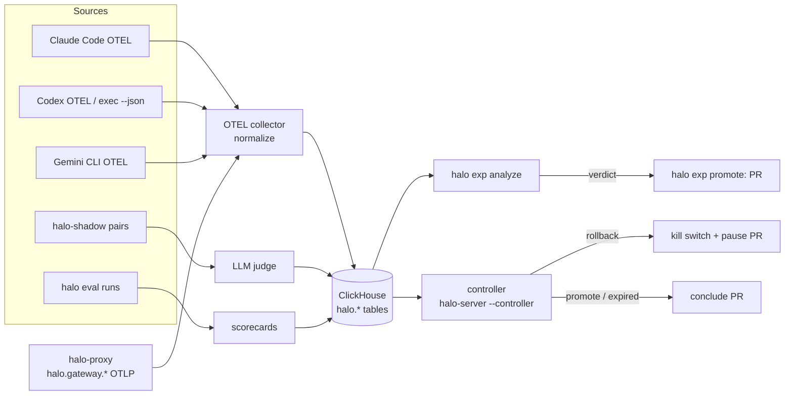

The evidence plane decides whether a change is safe. It has four parts, plus a consumer that acts on them: the [controller](#5-the-controller).



## 1. Telemetry normalization

Harness-native metrics are mapped to one `halo.*` schema so an experiment can compare across harnesses. Ring, release and experiment identifiers ride along as resource attributes (`OTEL_RESOURCE_ATTRIBUTES` for Claude Code). See [metrics reference](/halos/reference/metrics/).

The normalized table is `halo.halo_metrics` in ClickHouse, filled by materialized views over the collector's raw `otel_*` tables:

| Source | Lands as |
|---|---|
| CLI metrics (sums, gauges, histograms) | `halo.*` rows, for example `halo.cost.usd`, `halo.tokens`, `halo.edit.decision` |
| CLI log events (`claude_code.api_request`, `gemini_cli.api_response`, `codex.api_request`, tool results) | One row per call: `halo.api.request` and `halo.tool.call`, `value` = duration in ms, `attrs['error']` = `1` on failure. Prompts, tool input and error text are never kept |
| `halo-proxy` per-request OTLP (`--telemetry-otlp-endpoint`) | `halo.gateway.requests` (count by `status_class`) and `halo.gateway.latency_ms` (histogram). The gateway assigns ring and variant itself, so this is the best-attributed source and the only online one for traffic-axis experiments. Sent to the collector's authenticated gateway receiver (`telemetry.tokenFile` / `--telemetry-token-file`). The unit is `halo.unit`, a salted hash of the **verified subject**; requests without one are counted but are not experiment units. Client session ids never define units, and no prompts, headers, session or user ids are exported |

### Derived per-unit metrics

Experiments name registry metrics such as `halo.cost.usd_per_session`; ClickHouse holds the raw rows. `halo exp analyze` and the controller compute **one value per unit** (per user for CLI data, per hashed verified user for gateway data) and compare the two arms' samples:

| Registry metric | Per-unit value |
|---|---|
| `halo.cost.usd_per_session` | The unit's `halo.cost.usd` divided by its distinct sessions |
| `halo.tokens.per_session` | The unit's input+output `halo.tokens` divided by its distinct sessions |
| `halo.edit.accept_rate` | Accepted / total `halo.edit.decision` |
| `halo.api.error_rate` | Gateway: non-2xx / all `halo.gateway.requests`. CLI fallback: failed / all `halo.api.request` |
| `halo.latency.p50_ms`, `halo.latency.p95_ms` | Gateway: quantile interpolated from `halo.gateway.latency_ms` buckets, 2xx only. CLI fallback: exact quantile of successful `halo.api.request` durations |
| `halo.tool.error_rate` | Failed / total `halo.tool.call` |

Sources are tried in that order and never mixed in one analysis, because their units differ. Gateway rows count only if the collector stamped `attrs['halo.source'] = 'gateway'` on them (see [evidence trust](#evidence-trust)); the source that decided a verdict is reported as `source` in `halo exp analyze --output json` and per guardrail. Metrics not listed there (and not `eval`-only) are read as the unit's mean of the raw metric. `halo.session.duration_s` has no online source yet, and `halo.task.success` is offline-eval only. Source of truth: `internal/policy/metrics.go` and `internal/promote/source.go`.

### Evidence trust

Developer machines must reach the collector, so the CLI receiver is effectively open: anyone can post metrics carrying any `halo.experiment` / `halo.variant`. The generated collector config therefore splits receivers:

| Receiver | Port | Auth | Collector action |
|---|---|---|---|
| `otlp` (CLIs) | 4317 gRPC, 4318 HTTP | none by default; per-device bearer tokens with `--cli-token-file` (one per line, re-read on change; recommended) | drops every `halo.gateway.*` metric, overwrites `halo.source=cli`, caps requests at 4 MiB |
| `otlp/gateway` (`halo-proxy`) | 4319 HTTP (`--gateway-endpoint` changes the listen address) | bearer token from `HALO_OTLP_GATEWAY_TOKEN` (the collector refuses to start without it) | stamps `halo.source=gateway` |

`halo.source` is stamped on every data point by the receiver it arrived on; a client-supplied value is overwritten, never kept. `--cli-token-file` takes a path **as the collector sees it** (mount the file into the collector pod) and gives each device its own token, so one leaked token can be removed without touching the rest. Even with tokens the CLI plane is client-controlled: a token holder can still send forged CLI metrics, which is why only the gateway plane may kill.

The controller trips the kill switch **only** when the deciding evidence is gateway-sourced. A rollback decided by CLI telemetry (or by a source that can't say where its data came from) still opens the pause PR and notifies, and a human decides. Promote and expiry never act without a merged PR. Known limits: `maxSpendUSD` reads CLI-reported `halo.cost.usd`, so forged cost can make an experiment `expired` early (a conclude PR, never a kill); and rows written before this split have no `halo.source`, so their gateway rows stop counting. There is no per-experiment opt-in to trust CLI telemetry for kills.

## 2. Replay evals

`halo eval run <suite.yaml>` runs each task in a Docker container with a headless driver and scores the outcome by a shell `check`. It is the only way to compare **whole agent tasks**, because tool calls really execute in the sandbox. Trials run with no network egress by default (`--network none`).

| Harness | Driver |
|---|---|
| Claude Code | `claude -p --restricted --output-format stream-json --max-budget-usd` |
| Codex | `codex exec --json` (JSONL events) |
| Gemini CLI | `gemini -p` |

Guide: [writing evals](/halos/guides/writing-evals/).

## 3. Statistics

`halo exp analyze` uses mSPRT for always-valid sequential testing and bootstrap confidence intervals. Guardrails abort on `maxRegression`. Hard ceilings: `maxDays`, `maxSpendUSD`.

## 4. Gated promotion

`halo exp promote` requires a `promote` verdict and opens a PR that moves the ring pointer in policy YAML. A human merges; a human or CI then runs `halo release promote`. **Auto-rollback is allowed; auto-promote never.**

## Scorecard

A scorecard is the output of `halo eval run` (text, or `--output json`): per-task, per-variant pass rate, cost, latency and turns, with bootstrap confidence intervals against the control variant. The MCP tool `eval_scorecard` reads the JSON form.

## 5. The controller

The [controller](/halos/concepts/experiments/#the-controller-loop) is a ClickHouse consumer: on a timer it runs the same evaluation as `halo exp analyze` for every running experiment and acts on the verdict (kill switch and pause PR on rollback, conclude PR on promote or expiry). It reads `halo_metrics` over ClickHouse's HTTP interface with server-side bound parameters. **Auto-rollback is allowed; auto-promote and auto-merge never.** The kill switch is tripped only on gateway-sourced evidence ([evidence trust](#evidence-trust)).

## Running the pipeline

```bash
halo telemetry collector-config --clickhouse tcp://clickhouse:9000 -o otel-collector.yaml
# collector env: HALO_OTLP_GATEWAY_TOKEN=<secret>; halo-proxy: --telemetry-otlp-endpoint http://collector:4319 --telemetry-token-file <file with the same secret>

# optional: require a per-device bearer token on the CLI receiver (one token per line)
halo telemetry collector-config --clickhouse tcp://clickhouse:9000 --cli-token-file /etc/otelcol/cli-tokens -o otel-collector.yaml
```

Set the same `--telemetry-unit-salt-file` on every `halo-proxy` replica so one user stays one `halo.unit`; without it each process picks a random salt and units split across restarts.

The stack in `deploy/observability/` (otel-collector-contrib, ClickHouse, Grafana) uses the schema in `deploy/observability/clickhouse/schema.sql` and the dashboard in `deploy/observability/grafana/dashboard.json`.

## What is proven

`make obs-e2e` (needs Docker and network) brings up that stack and runs `test/e2e/obs_test.go` with synthetic harness telemetry (`internal/telemetry/synth`, shaped like Claude Code, Codex and Gemini CLI output) plus gateway metrics sent by `halo-proxy`'s real OTLP emitter (`internal/telemetry/gwmetrics`). It asserts, end to end:

- rows land in `halo_metrics`, no un-normalized `claude_code.*` rows reach ClickHouse, and the harness, ring, release, experiment and variant columns are populated;
- CLI log events become `halo.api.request` and `halo.tool.call` rows that carry only the allowed attributes (no prompt or error text), and gateway request and histogram counts match what was sent;
- `halo exp analyze` returns `rollback` on the guardrail that was regressed on purpose: cost per session (+30%), API error rate (3% to 15%), p95 latency from CLI events (+40%), and p95 latency visible **only** in gateway data, which proves the gateway source takes precedence; an experiment with identical arms returns `continue`;
- evidence trust: `halo.gateway.*` metrics forged on the CLI receiver never land, the gateway receiver rejects a missing or wrong token with 401, CLI-decided rollbacks report `source: cli` (so the controller won't auto-kill on them) and the gateway-decided one reports `source: gateway`;
- the verdicts file records them, and every panel query of the provisioned Grafana dashboard runs and returns data.

**UNVERIFIED:** real harness telemetry from real CLIs, real `halo-proxy` traffic into a real collector, scale, and the controller acting on ClickHouse in the same stack (the controller and its kill switch are unit-tested; `make obs-e2e` stops at verdicts).
