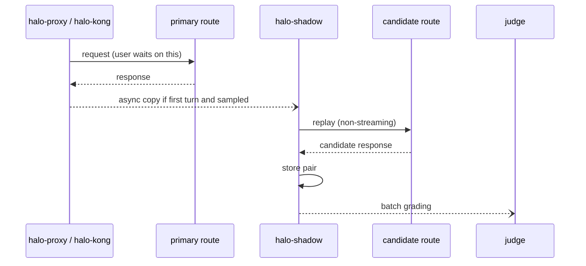

The shadow mirror (`halo-shadow`) sends a sampled, asynchronous copy of production requests to a candidate route and stores request/response pairs for grading. Kong OSS has no request-mirroring plugin, so Halos ships its own. `halo-proxy` and `halo-kong` both enqueue mirror jobs.

## The limit, stated plainly

**Shadowing is single-turn only.** A coding agent's turns are linked by tool calls with side effects: edit a file, run the tests, read the output. The candidate's tool calls never execute in the developer's workspace, so from turn 2 the candidate would be answering a conversation it did not produce. Executing them would double side effects and is unsafe. Details: [ADR-0004](/halos/adr/0004-shadow-single-turn-only/).

So `halo-shadow`:

- mirrors **first-turn** requests only (no tool results in the history),
- replays each to both the control and the candidate route (non-streaming, with halo-shadow's own credentials; client credentials are never forwarded),
- **resolves both upstreams from its own copy of the compiled policy** (`-policy`, hot-reloaded). A mirror job names only an experiment and variant, so the shadow token cannot be used to point halo-shadow, or its per-upstream credentials, at an arbitrary URL,
- grades pairs with an LLM judge and compares latency, tokens, refusal and format errors,
- does not tell you whether the candidate finishes multi-step tasks. Use [replay evals](/halos/guides/writing-evals/) for that.



## Config

```yaml
apiVersion: halos.dev/v1alpha1
kind: Experiment
name: opus-5-5-shadow
type: shadow
axis: traffic
rings: [ring0-harness-team]
sampleRate: 0.05
variants:
  - {name: control, weight: 1, control: true}
  - name: candidate
    weight: 1
    routes:
      opus: {upstream: orchestrator, model: us.anthropic.claude-opus-5-5-v1:0}
metrics:
  primary: {metric: halo.task.success, direction: increase}
stopping: {method: fixed, minSamples: 500, maxDays: 7, maxSpendUSD: 200}
```

`sampleRate` is the fraction (0-1) of eligible requests mirrored.

## Running halo-shadow

```bash
halo gateway compile --policy-dir policy-repo -o policy.json
halo-shadow -policy policy.json -listen 127.0.0.1:8090 -out pairs.jsonl \
  -pair-key-file pair.key -upstream-headers upstream-headers.yaml \
  -budget-usd 50 -retention 720h
```

| Flag | Default | Purpose |
|---|---|---|
| `-policy` | | Compiled policy snapshot; upstreams are resolved from it |
| `-listen` | `127.0.0.1:8090` | Loopback by default; put it behind your network policy |
| `-out` | `pairs.jsonl` | JSONL pair file, mode 0600 |
| `-pair-key-file` | | Base64 32-byte key: encrypt pairs at rest (AES-256-GCM) |
| `-upstream-headers` | | YAML/JSON `{upstreamName: {Header: value}}`; `${ENV}` expanded |
| `-budget-usd` | 50 | Stop accepting jobs at this *estimated* spend (each job reserves its worst case first) |
| `-price-in`, `-price-out` | 3, 15 | USD per million input and output tokens for the estimate |
| `-queue`, `-workers` | 64, 4 | Bounded queue (excess dropped) and replay workers |
| `-retention` | 720h | Prune pairs older than this (0 = keep forever) |

The auth token is read from the environment (`HALO_SHADOW_TOKEN`) and sent by the proxy as `X-Halo-Shadow-Token`; the proxy takes it from `--halo-shadow-token` or `HALO_PROXY_HALO_SHADOW_TOKEN`.

## Guarantees and non-guarantees

| | |
|---|---|
| Primary response and latency unaffected | Design goal: the mirror is async, bounded and dropped when the queue is full (`halo_proxy_shadow_dropped_total`). The effect on primary latency was **not measured**. |
| Candidate cost bounded | `sampleRate`, `maxSpendUSD` and halo-shadow's `-budget-usd` (an estimate from token prices, not a billing figure) |
| Prompts stored | Pairs contain prompts and responses. Encrypt at rest with `-pair-key-file`, set `-retention`, restrict the file. Treat as sensitive. |
| Client credentials | Never included in jobs; only `anthropic-version|beta` and `openai-beta` headers are forwarded |
| Multi-turn quality | Not measured. Use replay evals. |

## Recommended recipe

Shadow (first-turn safety) then canary (real sessions, guardrails) with replay evals gating both. Never promote on shadow alone.
