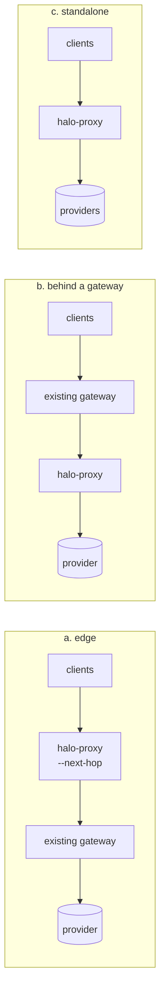

The traffic plane does five things for every model call: verify the caller, assign a ring and variant, rewrite the model alias, stamp `x-halo-*` headers, and mirror sampled first turns. `halo-proxy` does all five as one static Go binary that works with any gateway (or none), any OIDC identity provider, and any provider that speaks `anthropic-messages`, `openai-responses` or Bedrock invoke/converse paths, and it can sign Bedrock requests itself. The `halo-kong` plugin runs the same decision code inside Kong.

## Deploy modes



| | (a) edge | (b) behind a gateway | (c) standalone |
|---|---|---|---|
| Identity | JWT (default): the client's token is what `halo-proxy` sees | `trusted_header` with `trustedProxyCIDRs` = the gateway's addresses, **or** JWT if the gateway forwards `Authorization` | JWT |
| Upstream | `nextHop: http://kong:8000` | policy upstreams (or `defaultUpstream`) | policy upstreams plus `upstreamHeaders` for provider keys |
| `forwardAuth` | `true` if the gateway behind must authenticate the same token | usually `false` | `false`; inject provider credentials via `upstreamHeaders` |
| Client IP | sees the real client | sees only the gateway | real client |

Pick (a) when the existing gateway must stay authoritative for auth and rate limits and you can change client base URLs to `halo-proxy`. Pick (b) when clients must keep hitting the gateway; there the gateway must **overwrite** the identity header and `halo-proxy` must be unreachable except from it. Model rewriting happens in every mode, including `--next-hop`: the next hop receives the *upstream* model id, not the alias.

## Running halo-proxy

```bash
halo gateway compile --policy-dir policy-repo -o policy.json                    # hot-reloaded by halo-proxy (~1s)
halo-proxy --policy policy.json --listen :8088                     # (c), issuer from the policy
halo-proxy --policy policy.json --next-hop http://kong:8000 --forward-auth   # (a)
halo-proxy --config halo-proxy.yaml
```

Precedence: defaults, then YAML (`--config` or `HALO_PROXY_CONFIG`), then env `HALO_PROXY_<FLAG>` (for example `HALO_PROXY_HALO_SHADOW_TOKEN`), then flags. Unknown YAML keys are errors.

```yaml
listen: ":8088"
policy: /etc/halos/policy.json
nextHop: ""                  # (a): forward everything here
defaultUpstream: ""          # for paths the policy has no route for (for example /v1/models)
forwardAuth: false           # keep client Authorization / x-api-key on the forwarded request
upstreamHeaders:             # per policy upstream name; ${ENV} expanded
  anthropic: {x-api-key: "${ANTHROPIC_API_KEY}", anthropic-version: "2023-06-01"}
identity:
  mode: ""                   # jwt | trusted_header | none
  issuer: ""                 # default: policy identity.issuer
  audience: ""               # default: policy identity.audience / clientID
  userClaim: ""              # default email
  groupsClaim: ""            # default groups
  identityHeader: ""         # trusted_header only
  groupsHeader: ""
  trustedProxyCIDRs: []
  allowAnonymous: false
shadow: {url: "", token: "", maxBytes: 1048576}
maxBodyBytes: 33554432       # 32 MiB; larger => 413
readHeaderTimeout: 10s
readTimeout: 5m              # request only; responses are never time-limited
idleTimeout: 2m
upstreamHeaderTimeout: 10m   # wait for response headers; then the stream is unbounded
shutdownTimeout: 30s         # graceful drain of in-flight streams
```

Each YAML key has a flag of the same intent (`--listen`, `--policy`, `--next-hop`, `--default-upstream`, `--forward-auth`, `--identity-mode`, `--issuer`, `--audience`, `--identity-header`, `--groups-header`, `--trusted-proxy-cidrs`, `--allow-anonymous`, `--halo-shadow-url`, `--halo-shadow-token`, `--max-body-bytes`, `--read-timeout`, `--upstream-header-timeout`, `--shutdown-timeout`). Run `halo-proxy --help` for defaults.

### Behavior worth knowing

- **Identity.** With an issuer known (flag or policy) the default mode is `jwt`. Failed verification returns 401 unless `allowAnonymous`, in which case the caller gets default routing and ring `unknown` (useful when the token is an opaque API key meant for the next hop). With no issuer, no CIDRs and no explicit mode, `halo-proxy` fails closed with 503.
- **Model allowlist fails closed**, 413 on oversize bodies, batches API 403. See [security model](/halos/concepts/security-model/#model-allowlist-fails-closed).
- **Streaming is never buffered**: SSE and AWS eventstream stay incremental; there are no retries (a retried LLM call is a duplicated bill).
- **Client credentials** (`Authorization`, `x-api-key`) are stripped unless `forwardAuth: true`, and are never included in shadow jobs.
- **Endpoints:** the public `listen` address serves only proxied model calls and `GET /v1/models` (passthrough); every other path is 404. `GET /healthz` (503 until a policy snapshot loads) and `GET /metrics` live on a separate unauthenticated admin listener, `--admin-listen` / `adminListen` (default `127.0.0.1:9090`, empty disables); in Kubernetes set `:9090` and restrict it with a NetworkPolicy. Metrics (Prometheus: `halo_proxy_requests_total{ring,variant,status}`, TTFB and duration histograms, auth-failure and shadow counters). Access log is one JSON line per request with no bodies, headers or user ids.
- TLS: `halo-proxy` serves plain HTTP; terminate TLS in front of it.

### Kill switch

`halo-proxy` (and `halo-kong`) poll `halo-server`'s signed kill list and treat killed experiments as not running: control routing, no mirroring, no experiment headers. Configure it with `killSwitch.url`, `tokenFile` and `pubkeyFile` (flags `--killswitch-*`); all three are required together. A failed fetch keeps the last list, and a gateway that never fetched one kills nothing. Full behavior: [experiments](/halos/concepts/experiments/#kill-switch) and the [halo-proxy README](https://github.com/dshakes/halos/blob/main/cmd/halo-proxy/README.md#kill-switch).

### Per-request telemetry

With `--telemetry-otlp-endpoint` (YAML `telemetry`), `halo-proxy` exports `halo.gateway.requests` and `halo.gateway.latency_ms` over OTLP/HTTP with the ring, variant and model it assigned. No prompts, headers, user ids or session ids are exported; the per-unit key is a salted hash. These feed `halo.api.error_rate` and `halo.latency.*` for experiments, and are the only online source for traffic-axis ones. See [evidence plane](/halos/concepts/evidence-plane/).

## Integrations

Starting points in `deploy/integrations/`, not turnkey deployments. Files marked "generated" come from `internal/gateway/adapters`; edit the templates and run `go test ./internal/gateway/adapters -update`.

| Stack | What is provided | Checked | UNVERIFIED |
|---|---|---|---|
| **Kong** (OSS, Enterprise, Konnect) | Route to `halo-proxy` (`kong.yml`, no plugin server), or the `halo-kong` plugin (`halo gateway deck`) | `kong config parse` (3.8, db-less) OK; the `deploy/compose` demo runs Kong OSS + `halo-kong` end to end | Live traffic through the route-to-`halo-proxy` template; **Kong Enterprise and Konnect** |
| **Envoy / Istio** | Static bootstrap with route `timeout: 0s` and `stream_idle_timeout` | `envoy --mode validate` (v1.32) OK | Live traffic |
| **nginx** | `location` with `proxy_buffering off`, HTTP/1.1, long timeouts; `proxy_pass` without a URI so encoded Bedrock paths survive | `nginx -t` OK | Live traffic |
| **AWS API Gateway** | HTTP API to VPC link to internal ALB to `halo-proxy` (`openapi.yaml`) | nothing | Everything: not imported into AWS. HTTP APIs cap integration time and do not stream; verify quotas before routing agent traffic through it |
| **LiteLLM** | `halo-proxy` in front of LiteLLM (`--next-hop`), or LiteLLM as a policy upstream | nothing | Everything: written from LiteLLM's documented config, not run |

Kong specifics worth keeping if you hand-edit the generated config: exact regex routes (prefix routes would let `/v1/messages/batches` bypass the allowlist), `KONG_NGINX_HTTP_CLIENT_BODY_BUFFER_SIZE=32m` (otherwise bodies spool to disk and are answered 413), https-only routes, and the shadow token as a Kong vault reference (`{vault://env/halo-shadow-token}` plus `KONG_NGINX_MAIN_ENV=HALO_SHADOW_TOKEN`). A literal token is refused by the generator. If a Kong auth plugin hides the `Authorization` header, either forward it or use `trusted_header` with the CIDR pin. Never put Kong in front of an auth gateway and trust its `x-*-user` header: it is client-controlled there.

## Providers

A policy **upstream** is a base URL; a **model route** maps a stable alias to `{upstream, model}`. `halo-proxy` joins the upstream's path prefix with the request path and can inject credentials per upstream (`upstreamHeaders`). It does **not** translate wire protocols. The one provider it signs for is Amazon Bedrock (below).

| Provider | Works directly? | Notes |
|---|---|---|
| Bedrock direct (`kind: bedrock`) | Yes, with `halo-proxy` | SigV4 signing by `halo-proxy` with its own AWS identity. Not `halo-kong` or `halo-shadow`. See below |
| Bedrock via your orchestrator | Yes | The orchestrator does SigV4 and speaks Anthropic or Bedrock paths (`kind: orchestrator`) |
| Anthropic API | Yes | `x-api-key` and `anthropic-version` via `upstreamHeaders` |
| Azure AI Foundry (Claude) | Likely | Anthropic-compatible endpoint under a path prefix; confirm endpoint and header |
| OpenAI-compatible (OpenAI, Azure OpenAI, vLLM) | Yes for `/v1/responses` | Needs the Responses API on the target |
| Google Vertex (Claude) | **No** | Different wire format (model in the URL: `:rawPredict`, `:streamRawPredict`). The model allowlist rejects those paths, so `halo-proxy` neither routes nor signs them. Put LiteLLM or another translator in front and use it as the upstream |

All provider templates are **UNVERIFIED** (no provider accounts were available). Real Amazon Bedrock has not been exercised.

### Direct Bedrock (SigV4 in halo-proxy)

Point Claude Code at `halo-proxy` in Bedrock mode. `halo-proxy` verifies the developer's JWT, rewrites the alias to the real model or inference-profile ARN, then signs the request with **its own** AWS identity. The developer needs no AWS credentials.

**1. Policy.** Declare a `bedrock` upstream and an alias (region comes from the host, or is set explicitly for a custom or VPC endpoint host):

```yaml
protocols: {claude-code: bedrock-invoke}     # renders the Bedrock env below
upstreams:
  bedrock: {url: "https://bedrock-runtime.us-east-1.amazonaws.com", kind: bedrock}
  bedrock-vpce: {url: "https://bedrock.corp.example", kind: bedrock, region: eu-west-1}   # custom DNS name: also needs signHosts (step 4)
models:
  sonnet: {upstream: bedrock, model: "arn:aws:bedrock:us-east-1:123456789012:inference-profile/us.anthropic.claude-sonnet-4-5-20250929-v1:0"}
```

**2. Claude Code environment.** With `protocols: {claude-code: bedrock-invoke}` the adapter renders these into managed settings; set them by hand otherwise:

```bash
export CLAUDE_CODE_USE_BEDROCK=1
export ANTHROPIC_BEDROCK_BASE_URL=https://halo-proxy.internal.example.com   # gateway.baseURL
export CLAUDE_CODE_SKIP_BEDROCK_AUTH=1      # the CLI sends no SigV4; halo-proxy signs
export ANTHROPIC_MODEL=sonnet               # a policy alias, not a Bedrock id
```

Claude Code still needs its Halos JWT: `gateway.auth.helperCommand` becomes `apiKeyHelper`, and the token's `aud` must match `identity.audience`.

**3. Credentials for halo-proxy.** The AWS SDK default chain, resolved on first use and refreshed before expiry: environment (`AWS_ACCESS_KEY_ID` and friends), shared config or SSO (`AWS_PROFILE`), web identity (**EKS IRSA** or **Pod Identity**), ECS task role, EC2 instance profile. On EKS, annotate the `halo-proxy` service account with the IAM role. Grant it `bedrock:InvokeModel` and `bedrock:InvokeModelWithResponseStream` on the models and inference profiles named in policy. Credentials are never logged.

**4. Region and host rules.** `halo-proxy` signs only when the upstream is `kind: bedrock`, a region is known, **and** the host is allowed to receive the gateway's signature. The region is either `region` (validated, for example `us-east-1`; only allowed on `kind: bedrock`) or derived from a `bedrock-runtime[-fips].<region>` host label. The host must end in `.amazonaws.com`, `.amazonaws.com.cn` or `.api.aws`, or be listed in the `signHosts` setting of `halo-proxy`'s config (exact hostnames, for example a private VPC endpoint DNS name):

```yaml
# halo-proxy config (not policy)
signHosts: [bedrock.corp.example]
```

A region on any other host gets `502 bad_upstream` ("policy upstream host is not allowed for signing") and an error log naming the host, so a policy change cannot send AWS credentials to a third party. `nextHop` and `defaultUpstream` are never signed. A malformed region also gives `502 bad_upstream`.

**5. Backward compatibility.** A `kind: bedrock` upstream on a non-AWS host where no region can be derived and none is set (an orchestrator or a SigV4 sidecar) is forwarded **unsigned**, exactly as before. Existing orchestrator setups need no change.

**What is signed.** SigV4, service `bedrock`, computed after the model rewrite over the final method, escaped path, host, `Content-Type`, `x-amz*` headers and the SHA-256 of the final body. The caller's `Authorization`, `x-api-key` and **all** `x-amz*` / `x-amzn*` headers are always dropped before the gateway sets its own, even with `forwardAuth: true`, so a client cannot smuggle a header into the signature. Paths: `invoke`, `invoke-with-response-stream`, `converse`, `converse-stream`; the `application/vnd.amazon.eventstream` response streams through unbuffered.

**No credentials** gives `502 upstream_auth_error` and nothing is forwarded unsigned.

**Check:** `halo validate` passes with the upstream, `halo-proxy` starts, and a request with a valid JWT for alias `sonnet` reaches Bedrock with an `Authorization: AWS4-HMAC-SHA256 ...` header. Verified with fixed-key tests (an AWS SigV4 test-suite vector plus a fake Bedrock that recomputes the signature). **UNVERIFIED:** real AWS Bedrock, IRSA and Pod Identity on a real cluster, and VPC endpoints.

Also not included: mTLS or SPIFFE identity, per-user rate limiting, retries.
