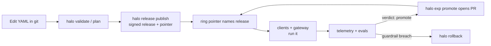

Halos (`halo`) is a control plane for AI developer tools in organizations. It treats configuration of Claude Code, Codex, Gemini CLI, Copilot CLI and similar harnesses as a **signed, ring-deployed release**, gates promotion on evidence, and routes model traffic through a plane you control so the most common rollback is instant.

## The problem

It is Tuesday morning and a CLI update reaches 300 developers. Something breaks behind your gateway. You cannot say who is on which version, whether the new one is worse, or how to undo it without asking everyone to downgrade.

- **Settings sprawl.** Each harness has its own config format and enforcement knobs.
- **No central channel on gateways.** Claude Code's server-managed settings are not fetched with Bedrock or a custom `ANTHROPIC_BASE_URL`, so config must be delivered as files, MDM profiles or environment definitions.
- **All-at-once upgrades.** No way to A/B a CLI or model upgrade.
- **No eval gate, no rollback.**

## What you get

| Need | Halos feature |
|---|---|
| One source of truth | [Policy repo](/halos/concepts/policy-model/) validated by JSON Schema and Go guardrails |
| Safe rollout | [Rings and releases](/halos/concepts/rings-and-releases/) with signed pointers |
| Prove a model or CLI change | [Experiments](/halos/concepts/experiments/), [shadow](/halos/concepts/shadow-traffic/), [evals](/halos/guides/writing-evals/) |
| Enforce on every machine | [Delivery](/halos/concepts/delivery/): dev containers first, `halod` and MDM for laptops |
| Developers help themselves | [Self-service portal](/halos/concepts/self-service-portal/) |
| Any gateway, any IdP | [Stack-agnostic traffic plane](/halos/concepts/stack-agnostic/) |
| Trust | [Signed bundles and pointers, verified identity, stripped headers](/halos/concepts/security-model/) |
| Let an agent drive it, safely | [Agentic operations](/halos/guides/agentic-operations/) |

## Mental model

## Where to go next

1. [Quickstart](/halos/getting-started/quickstart/).
2. [Architecture](/halos/concepts/architecture/).
3. The guide matching your setup: [Bedrock via Kong](/halos/guides/bedrock-via-kong/) or [direct Anthropic](/halos/guides/direct-anthropic/).
4. Going live: [production deployment](/halos/guides/production-deployment/) and the [threat model](/halos/reference/threat-model/).
