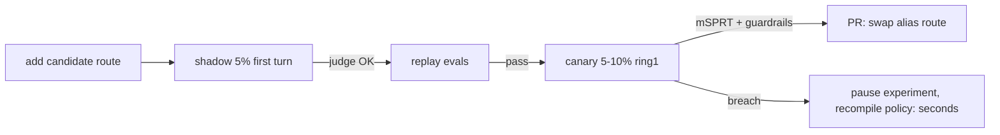
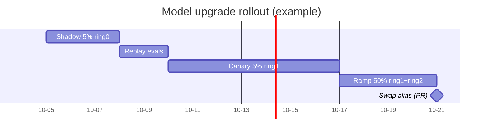

**Axis:** traffic. **Types:** `shadow`, then `canary`. No client change; clients keep requesting the alias. The example repo ships `sonnet-next-shadow.yaml` and `opus-5-5-canary.yaml` under `examples/acme-corp/experiments/`.



## 1. Shadow

Use the [shadow config](/halos/concepts/shadow-traffic/#config). Remember the limit: this checks first-turn behavior only ([ADR-0004](/halos/adr/0004-shadow-single-turn-only/)).

## 2. Replay evals

Run the eval suite against the candidate route (`evals/suites/model-upgrade.yaml` compares `sonnet` with `sonnet-next` on the same tasks). This is the multi-step signal shadow cannot give. See [writing evals](/halos/guides/writing-evals/).

```bash
halo eval run evals/suites/model-upgrade.yaml --output json > scorecard.json
```

## 3. Canary

```yaml
apiVersion: halos.dev/v1alpha1
kind: Experiment
name: opus-5-5-canary
type: canary
axis: traffic
status: running
rings: [ring1-canary]
variants:
  - {name: control, weight: 95, control: true}
  - name: opus-5-5
    weight: 5
    routes:
      opus: {upstream: orchestrator, model: us.anthropic.claude-opus-5-5-v1:0}
metrics:
  primary: {metric: halo.task.success, direction: increase}
  guardrails:
    - {metric: halo.api.error_rate, direction: decrease, maxRegression: 0.02}
    - {metric: halo.cost.usd_per_session, direction: decrease, maxRegression: 0.25}
    - {metric: halo.latency.p95_ms, direction: decrease, maxRegression: 0.15}
stopping: {method: msprt, alpha: 0.05, minSamples: 500, maxDays: 14, maxSpendUSD: 2000}
```

Start it with `halo exp start opus-5-5-canary --policy-dir policy-repo` (edits `status: running`), commit and merge, then `halo gateway compile --policy-dir policy-repo -o policy.json` so the gateway picks it up.

Assignment is sticky per user: an agent never changes model mid-task, and the variant comes from the verified identity, not a header.

## 4. Conclude or roll back

```bash
halo exp analyze opus-5-5-canary --policy-dir policy-repo --clickhouse http://clickhouse:8123
halo exp promote opus-5-5-canary --policy-dir policy-repo --clickhouse http://clickhouse:8123 \
  --ring ring1-canary --release sha256:... --dry-run
```

`halo exp promote` opens a PR (human merges); for a traffic change that PR changes the alias route in the Gateway document.

Rollback at any point, without touching a client: `halo exp pause opus-5-5-canary --policy-dir policy-repo`, commit, and recompile the snapshot. `halo-proxy` and `halo-kong` hot-reload the compiled policy (about a second), so users return to the control route. This is the fastest rollback Halos has, but it is only as fast as your policy pipeline: keep an on-call path that can compile and deploy the snapshot without a full review.

## Timeline


